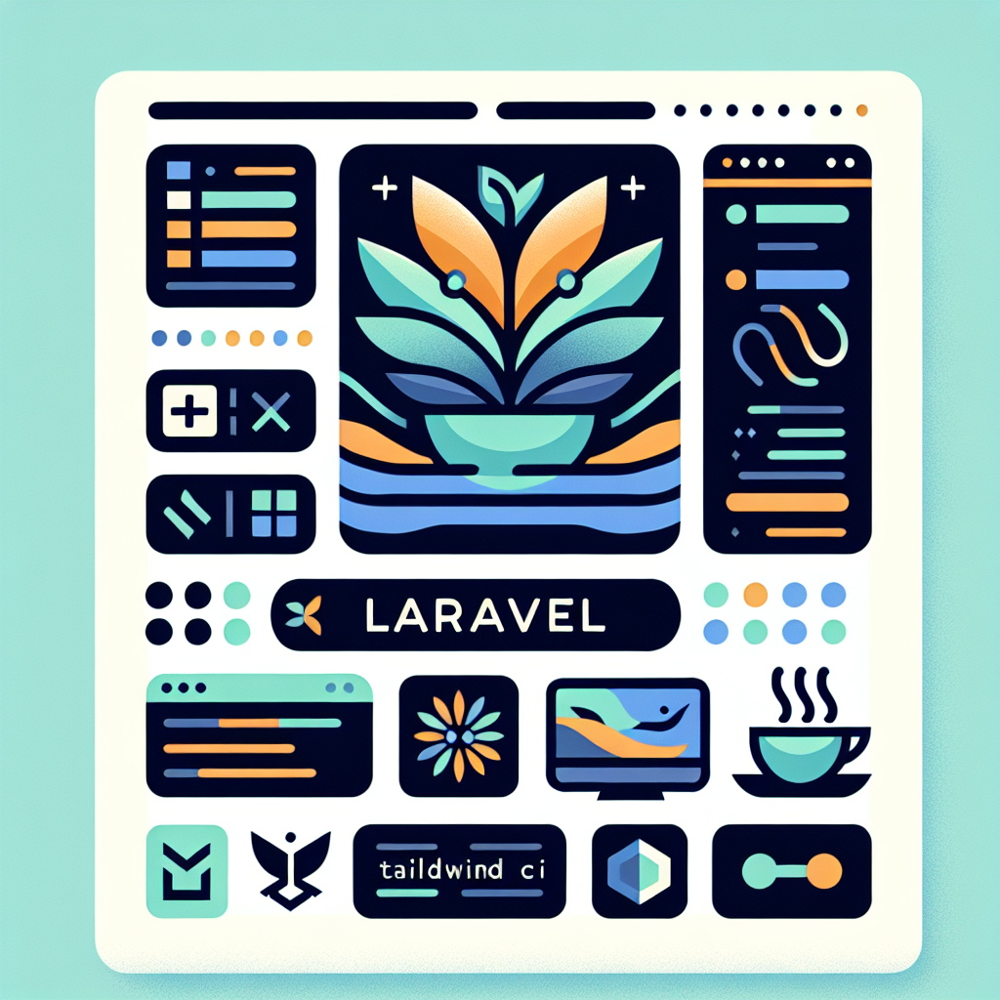
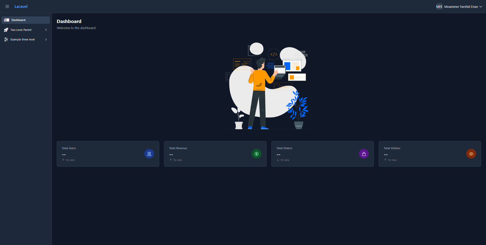
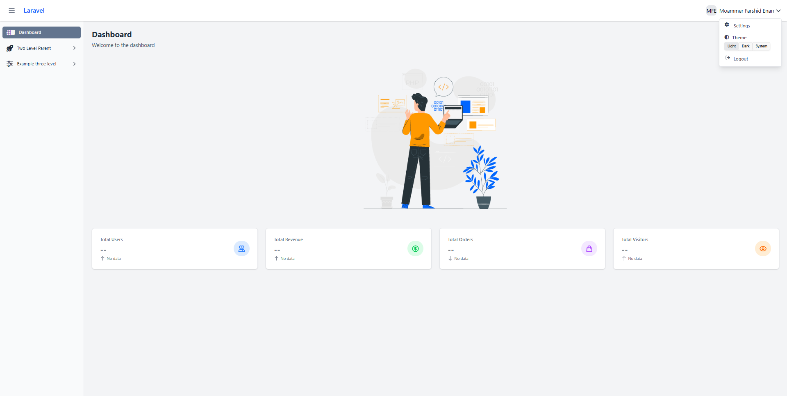
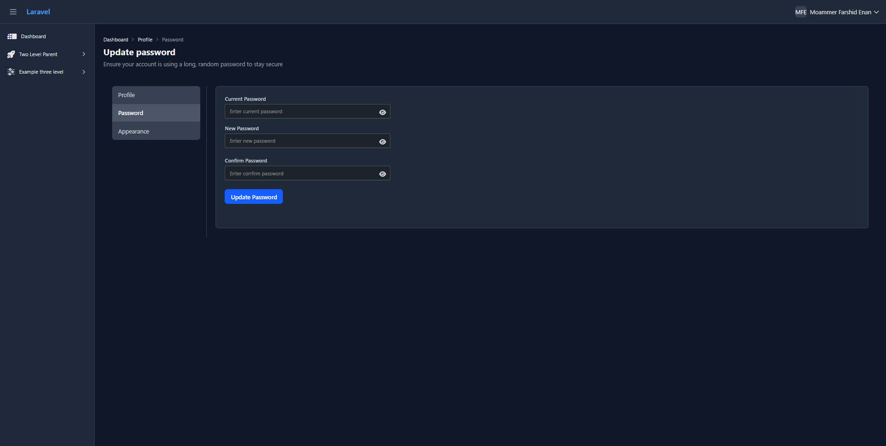
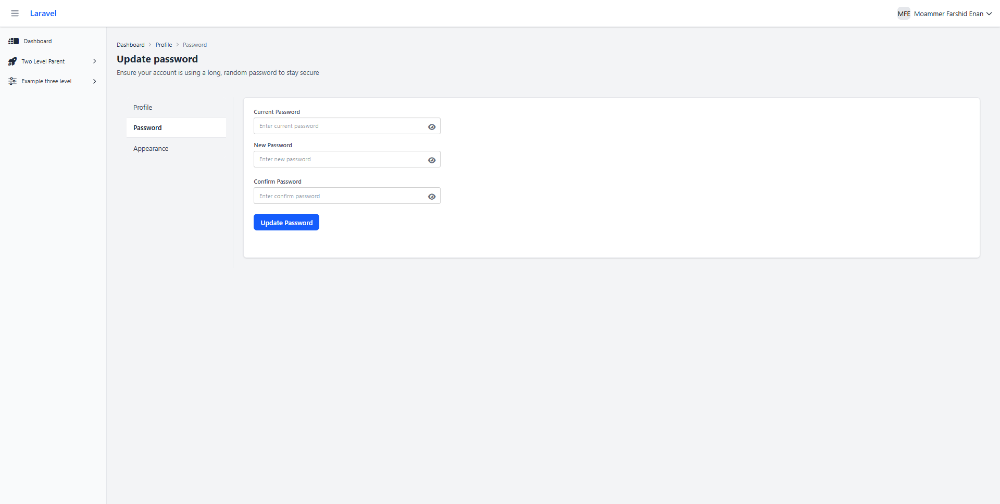

<p align="center">
    
</p>

<h1 align="center">Starter Kit Admin Panel</h1>

<p align="center">
    <b>A modern, customizable Laravel-based admin panel starter kit to kickstart your next project.</b>
</p>

# 📑 Table of Contents

- [🚀 Features](#-features)
- [🛠️ Getting Started](#️-getting-started)
  - [Prerequisites](#prerequisites)
  - [Installation](#installation)
- [📁 Components](#-components)
  - [Layouts](#layouts)
  - [Page Breadcrumbs](#page-breadcrumbs)
  - [Dashboard view](#dashboard-view)
  - [Forms Example](#forms-example)
  - [Sidebar](#sidebar)
  - [Table](#table)
- [Example](#example)

# 🚀 Features

-   🔒 **Authentication & Authorization** – Secure login, registration, and role-based access.
-   📊 **Responsive Dashboard** – Works flawlessly across desktop, tablet, and mobile.
-   🧩 **Modular Components** – Reusable, maintainable Blade components for forms, tables, and more.
-   🎨 **Light & Dark Mode** – Easy theme toggling with Tailwind & DaisyUI.
-   ⚡ **Fast Developer Experience** – Preconfigured tooling for rapid development.
-   📦 **Search and Filter Functionalities** - Added eloquent filter search functionality
-  	📸 **Image Intervention** - Highly customizable image intervention


# 🔧 Extra Packages

- 	[intervention/image-laravel](https://github.com/mehdi-fathi/eloquent-filter)
-	[mehdi-fathi/eloquent-filter](https://image.intervention.io/v3)


# 🛠️ Getting Started

## Prerequisites

Ensure you have the following installed:

-   [PHP](https://www.php.net/) **8.2+**
-   [Node.js](https://nodejs.org/) **v16+**
-   [Composer](https://getcomposer.org/)

## Installation

```bash
git clone https://github.com/enuenan/starter-kit-admin-panel.git
cd starter-kit-admin-panel
composer install
npm install
```

```bash
cp .env.example .env
php artisan key:generate
```

## Running the App

```bash
php artisan serve
npm run dev
```

The app will be available at:

Backend: http://localhost:8000

## 📁 Components

### Layouts

```bash
# File path
resources/
├── views/
│   ├── components/
│   │   |── layouts/
│   │   │   |── app.blade.php

# Usage
<x-layouts.app>
    # This is the base layout
    # Your page components will be here
</x-layouts.app>

```

### Page Breadcrumbs

```html
<x-breadcrumbs :items="[
    ['label' => __('Dashboard'), 'url' => route('dashboard.view')],
    ['label' => __(key: 'Users'), 'url' => route('user.index')],
    ['label' => __('View')], // Current page, no URL
]" />
```

### Dashboard view

```html
<x-layouts.app> 
    <x-breadcrumbs :items="[
        ['label' => __('Dashboard'), 'url' => route('dashboard.view')],
        ['label' => __(key: 'Users'), 'url' => route('user.index')],
        ['label' => __('View')], // Current page, no URL
    ]" />

    <x-card.view>

        <div class="max-w-4xl mx-auto px-6 py-10">
            <x-user.info :user="$user" show_below_links />
        </div>

        <div class="max-w-4xl">
            <x-user.info :user="$user" show_below_links />
        </div>

    </x-card.view>

</x-layouts.app>

```

### Forms Example

```html
<!-- action params is mandatory.-->
<!-- If method is not passed it will be POST request by default -->
<!-- Pass enctype as boolean to add enctype="multipart/form-data" -->
<x-forms.form action="" method="" enctype>

    <!-- For text type input -->
    <!-- if the field is required pass require attribute -->
    <x-forms.input label="" name="" type="text" value="" required />
    
    <!-- For email type input -->
    <x-forms.input label="" name="" type="email" value="" />

    <!-- If type=password you can see an eye icon to toggle the password -->
    <x-forms.input label="" name="" type="password" value="" required />

    <!-- If the input field is file type -->
    <!-- If you want to show the image from db you can pass the file path to show it on frontend -->
    <x-forms.input label="" name="" type="file" :file="" />

    <!-- Form footer to show the back and Submit/Update button -->
    <x-forms.footer buttonText="Update" />

</x-forms.form>
```

### Sidebar
```html
<!-- single sidebar link-->
<x-sidebar.link href="{{ route('dashboard.view') }}" icon="fa-solid fa-candy-bar" :active="">
    Dashboard
</x-sidebar.link>

<!-- Two level sidebar link-->
<x-sidebar.level-two-parent title="Two Level Parent" icon="fa-solid fa-rocket-launch" :active="<!--Please place your active route name here like dashboard -->">
    <x-sidebar.level-two-link href="{{ route('settings.profile.edit') }}"
        icon='fa-duotone fa-light fa-sliders' :active="<!--Please place your active route name here like dashboard -->">
        Two level child
    </x-sidebar.level-two-link>
</x-sidebar.level-two-parent>

<!-- Three level sidebar link-->
<x-sidebar.level-two-parent title="Example three level" icon="fa-duotone fa-light fa-sliders"
    :active="<!--Please place your active route name here like dashboard -->">
    <x-sidebar.level-two-link href="#" icon='fa-duotone fa-light fa-sliders'
        :active="<!--Please place your active route name here like dashboard -->">
        Third Level Child
    </x-sidebar.level-two-link>

    <x-sidebar.level-three-parent title="Third Level Second Parent"
        icon="fa-duotone fa-light fa-sliders" :active="<!--Please place your active route name here like dashboard -->">
        <x-sidebar.level-three-link href="#" icon='fa-duotone fa-light fa-sliders'
            :active="<!--Please place your active route name here like dashboard -->">
            Third Level Link
        </x-sidebar.level-three-link>
    </x-sidebar.level-three-parent>
</x-sidebar.level-two-parent>
```

### Table

```html
<!-- Table headers -->
@php
	$headers = ['Image', 'Name', 'Username', 'Email', ''];
@endphp
<!-- If you don't want to show headers/footers you can ignore them passing -->
<x-table.view :collection="$users" :headers="$headers" :footers="$headers">
	@forelse ($users as $user)
		<tr>
			<td>
				<!-- Lightbox image plugin to show image -->
				<x-lightbox-image
					src="{{ $user->avatar_url ?? 'https://api.dicebear.com/7.x/initials/svg?seed=' . urlencode($user->name) }}"
					class="{{ $user->avatar_url ? 'w-40 h-40' : 'w-15 h-15' }}"
					alt="User avatar {{ $user->id }}" />
			</td>
			<td>
				<!-- A beatiful card to show user info on hover -->
				<x-user.info-tooltip :user="$user" />
			</td>
			<td>{{ $user->username }}</td>
			<td>{{ $user->email }}</td>
			<td>
				<div class="flex">
					<!-- eye icon to show details view -->
					<a href="" class="btn btn-square btn-primary">
						<i class="fa-sharp-duotone fa-regular fa-eye"></i>
					</a>
					<!-- pen icon to go to edit page -->
					<a href="" class="btn btn-square">
						<i class="far fa-edit"></i>
					</a>
					<!-- This will pop up a modal to ask for delete -->
					<x-modals.delete :id="$user->username" :action="route('user.destroy', $user->username)" title="Deleting user"
						message="Are you sure you want to delete this user?" />
				</div>
			</td>
		</tr>
	@empty
		<x-table.empty-row :colspan="count($headers)" />
	@endforelse
</x-table.view>
```

## Example

<details>
  <summary>Example</summary>

  <p align="center">
    
    
    </br>
    
    
  </p>
</details>

</br>
</br>

# Instructions

For more you can go through the example

```bash
# File path
resources/
├── views/
│   ├── dashboard/
│   │   |── example/
│   │   │   |── create.blade.php
│   │   │   |── edit.blade.php
│   │   │   |── form.blade.php
│   │   │   |── index.blade.php
│   │   │   |__ view.blade.php
│   ├── components/

```